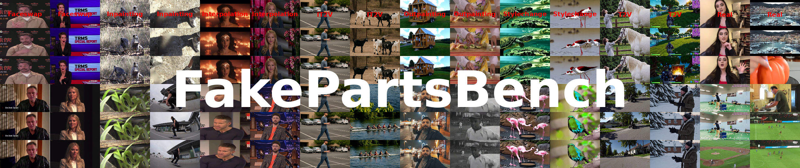
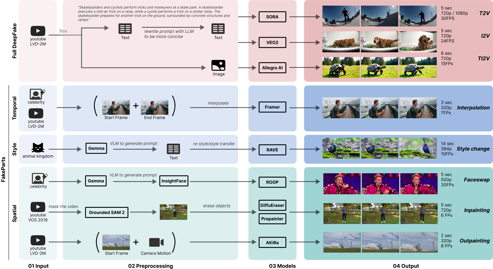

[](https://github.com/psf/black)
[](https://opensource.org/licenses/BSD-3-Clause)
[](https://huggingface.co/datasets/hi-paris/FakeParts)
[](https://arxiv.org/pdf/TBD)
# FakeParts: A New Family of AI-Generated DeepFakes

> **FakeParts** are *partial* deepfakes—localized spatial or temporal edits that blend into otherwise real videos.
> **FakePartsBench** is the first benchmark purpose-built to evaluate them.

<p align="center">
  
</p>

<p align="center">
  
</p>

---

## Summary

* **Problem.** Most detectors and datasets focus on *fully synthetic* videos. Subtle, localized edits (FakeParts) are under-explored yet highly deceptive.
* **Solution.** We define *FakeParts* and release **FakePartsBench**: 25K+ videos with **pixel-level** and **frame-level** annotations covering **full deepfakes** (T2V/I2V/TI2V) and **partial manipulations** (faceswap, inpainting, outpainting, style change, interpolation).
* **Finding.** Humans and SOTA detectors miss many FakeParts; detection accuracy drops by **30–40%** versus fully synthetic content.
* **Use.** Train and evaluate detectors that localize *where* and *when* manipulations happen.

---

## Contents

* [News](#news)
* [Dataset](#dataset)
* [Paper](#paper)
* [Repo Structure](#repo-structure)
* [Installation](#installation)
* [Quickstart](#quickstart)
* [Evaluation Protocol](#evaluation-protocol)
* [Reproducing Baselines](#reproducing-baselines)
* [Human Study](#human-study)
* [Results Snapshot](#results-snapshot)
* [Citations](#citations)
* [License & Responsible Use](#license--responsible-use)
* [Acknowledgements](#acknowledgements)
* [Contact](#contact)

---

## News

* **2025-** Dataset and benchmark released (including closed- and open-source generations).
* **2025-** Baseline evaluation code (image- and video-level detectors).

---

## Dataset 💽

**FakePartsBench** provides:

* **25,000+** manipulated clips + **16,000** real clips
* High-res content (up to 1080p), durations typically **5–14 s**
* **Annotations:** frame masks (spatial), manipulated frames (temporal)
* **Categories:**

  * **Full deepfakes:** T2V / I2V / TI2V (Sora, Veo2, Allegro AI)
  * **Spatial FakeParts:** Faceswap (InsightFace), Inpainting (DiffuEraser, ProPainter), Outpainting (AKiRa)
  * **Temporal FakeParts:** Interpolation (Framer)
  * **Style FakeParts:** Style change (RAVE)

**Download (mirrors):**

* [https://huggingface.co/datasets/hi-paris/FakeParts](https://huggingface.co/datasets/hi-paris/FakeParts)

> Each sample ships with metadata (prompt, source/cond frame when applicable, resolution, FPS) and, for FakeParts, per-frame masks or frame lists of manipulated regions/segments.

---

## Paper 📝

**FakeParts: a New Family of AI-Generated DeepFakes**
Gaëtan Brison, Soobash Daiboo, Samy Aïmeur, Awais Hussain Sani, Xi Wang, Gianni Franchi, Vicky Kalogeiton
Hi! PARIS / Institut Polytechnique de Paris / LIX  / ENSTA Paris
*Preprint, under review.*

---

## Repo Structure 

```
fakeparts/
├─ README.md
├─ env/                       # environment files (conda, pip)
├─ fakepartsbench/            # dataset helpers
│  ├─ download.py             # mirrors + integrity check
│  ├─ index.json              # split definitions
│  ├─ io.py                   # lazy video/mask loading
│  └─ viz.py                  # mask overlay, thumbnails
├─ eval/                      # evaluation protocols
│  ├─ image_level/            # CNNDetection, UFD adapters
│  ├─ video_level/            # DeMamba, AIGVDet adapters
│  ├─ metrics/                # F1, mAP, ROC, FVD (optional)
│  └─ run_eval.py
├─ baselines/                 # minimal wrappers + configs
│  ├─ cnndetection/
│  ├─ universal_fake_detector/
│  ├─ demamba/
│  └─ aigvdet/
├─ human_study/               # survey scripts (Streamlit)
└─ assets/
   ├─ final_teaser.png
   └─ pipeline_xi.jpg
```

> Tip: Place your images in `assets/` (the README references `assets/final_teaser.png` and `assets/pipeline_xi.jpg`).

---

## Installation

```bash
# (A) Conda (recommended)
conda create -n fakeparts python=3.10 -y
conda activate fakeparts
pip install -r env/requirements.txt

# (B) Extras (for video I/O & metrics)
# pip install av opencv-python imageio[ffmpeg] decord torch torchvision
```

* **FFmpeg** required for decoding/encoding (`ffmpeg -version` should work).
* Some baselines may require CUDA (see their READMEs in `baselines/`).

---

## Quickstart 🚀

### Download the dataset

```python
from datasets import load_dataset

# Load the dataset
dataset = load_dataset("hi-paris/FakeParts")

# Inspect the data
print(dataset)
```


```

---

## Evaluation Protocol

We report:

* **Binary detection** (real vs. fake) at **video** and **frame** levels
* **Localization** for FakeParts: IoU on manipulated **masks** (spatial) and **frames** (temporal)
* **Quality & consistency**: FVD (optional), VBench subset (consistency, flicker, quality)

**Default metrics:** Accuracy, F1, mAP (per category + macro avg).
**Recommended splits:** use `index.json` or our CSVs to reproduce the paper.

Run evaluation:

```bash
python eval/run_eval.py \
  --root /path/to/FakePartsBench \
  --config eval/configs/default.yaml \
  --save out/eval_default.json
```

---

## Reproducing Baselines

We include light wrappers that follow the authors’ official implementations.

### Image-level

* **CNNDetection** (Wang et al. CVPR’20)
* **UniversalFakeDetector** (Ojha et al. CVPR’23 w/ CLIP)


### Video-level

* **AIGVDet** (Bai et al. PRCV’24) – spatial + optical flow branches
* **DeMamba** (Chen et al. arXiv’24) – state-space temporal modeling


> Check the `baselines/*/README.md` for any extra model weights and licensing notes.

---

## Human Study

We release a **Streamlit**-based survey used in the paper.

```bash
cd annotation
pip install -r requirements.txt
streamlit run app.py -- --root /path/to/FakePartsBench
```

Participants label **real vs. fake** and provide short rationales per clip.

---

## Results Snapshot

Average “fake” confidence by detectors vs. humans (higher = better fake detection):

| Category                  | AIGVDet | CNNDetection | DeMamba | UniversalFakeDetect  | FatFormer | C2P-CLIP | NPR  | Human Detection |
| ------------------------- | ------: | -----------: | ------: | --------------------------------: | ----------------------: | --------------------: | ----------------------: | --------------: |
| **Acc. on orig. testset** |   0.914 |        0.997 |   0.971 |                             0.843 |                  ~0.990 |                 >0.930 |                 >0.925 |              – |
| **T2V**                   |   0.301 |        0.000 |   0.342 |                             0.073 |                   0.183 |                  0.176 |                  0.579 |          0.763 |
| **I2V**                   |   0.292 |        0.001 |   0.323 |                             0.083 |                   0.129 |                  0.157 |                  0.417 |          0.715 |
| **IT2V**                  |   0.483 |        0.000 |   0.514 |                             0.072 |                   0.161 |                  0.131 |                  0.666 |          0.821 |
| **Stylechange**           |   0.265 |        0.000 |   0.308 |                             0.295 |                   0.100 |                  0.288 |                  0.105 |          0.983 |
| **Faceswap**              |   0.216 |        0.000 |   0.265 |                             0.031 |                   0.620 |                  1.000 |                  0.000 |          0.612 |
| **Real** (false-positive) |   0.155 |        0.007 |   0.191 |                             0.052 |                   0.008 |                  0.004 |                  0.038 |          0.242 |
| **Interpolation**         |   0.137 |        0.000 |   0.170 |                             0.228 |                   0.360 |                  0.396 |                  0.056 |          0.676 |
| **Inpainting**            |   0.074 |        0.003 |   0.089 |                             0.337 |                   0.213 |                  0.171 |                  0.264 |          0.588 |
| **Outpainting**           |   0.060 |        0.000 |   0.072 |                             0.025 |                   0.096 |                  0.125 |                  0.014 |          0.800 |


**Takeaway:** Partial manipulations (FakeParts) are significantly harder for current detectors than fully synthetic videos—and also harder for humans.

---

## Citations

If you use **FakeParts** or **FakePartsBench**, please cite:

```bibtex
@article{brison2025fakeparts,
  title   = {FakeParts: a New Family of AI-Generated DeepFakes},
  author  = {Ga{\"e}tan Brison and Soobash Daiboo and Samy A{\"i}meur and
             Awais Hussain Sani and Xi Wang and Gianni Franchi and Vicky Kalogeiton},
  journal = {arXiv preprint},
  year    = {2025}
}
```

And cite **FakePartsBench** when evaluating:

```bibtex
@dataset{fakepartsbench2025,
  title        = {FakePartsBench},
  author       = {Brison, Ga{\"e}tan and Daiboo, Soobash and A{\"i}meur, Samy and
                  Sani, Awais Hussain and Wang, Xi and Franchi, Gianni and Kalogeiton, Vicky},
  year         = {2025},
  howpublished = {\url{https://huggingface.co/datasets/gaetanbrison/FakeParts}},
  note         = {Mirror: \url{https://huggingface.co/datasets/hi-paris/FakeParts}}
}
```

---

## License & Responsible Use

* **Code:** see `LICENSE` (default: BSD-3-Clause unless noted otherwise in subfolders).
* **Dataset:** released for **research and defensive purposes only**.

  * Do **not** attempt to identify private individuals.
  * Do **not** use for generating disinformation or harassment.
  * Faceswap content uses celebrity imagery to avoid sensitive personal data.
* Please comply with third-party model/data licenses cited in the paper and `baselines/`.

---

## Acknowledgements

This work was conducted at **Hi! PARIS**, **Institut Polytechnique de Paris**, **LIX (École Polytechnique)**, and **U2IS (ENSTA Paris)**. We thank the authors and teams behind Sora, Veo2, Allegro, Framer, RAVE, InsightFace, DiffuEraser, ProPainter, AKiRa, as well as the maintainers of DAVIS, YouTube-VOS, MOSE, LVD-2M, and Animal Kingdom.

A special thanks to the DeepMind team working on Veo2 and Veo3 for granting us early API access.

---

## Contact

Questions, issues, or pull requests are welcome!

* Gaëtan Brison — *maintainer*
* Soobash Daiboo, Samy Aïmeur, Awais Hussain Sani
* Xi Wang, Gianni Franchi, Vicky Kalogeiton
