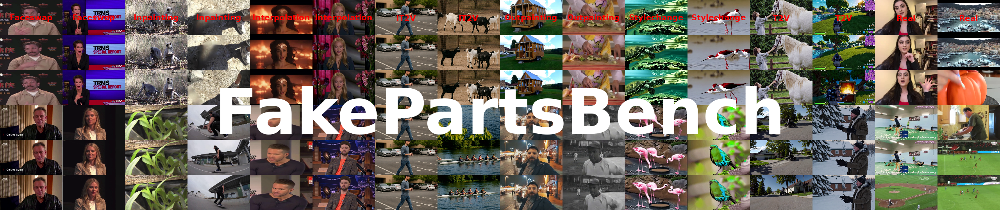
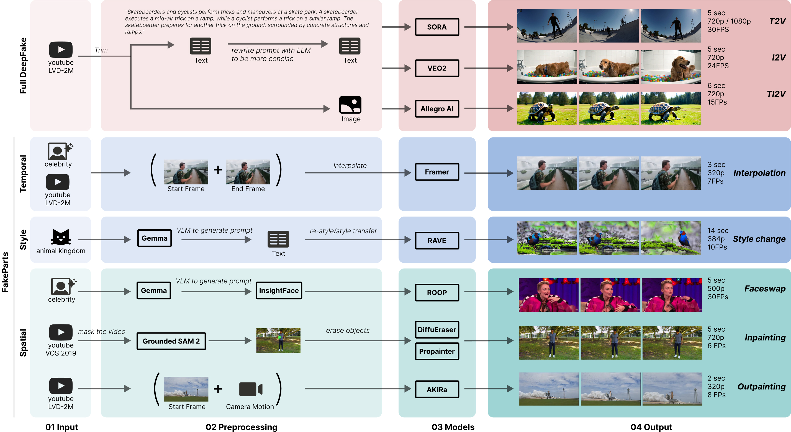

[](https://github.com/psf/black)
[](https://opensource.org/licenses/BSD-3-Clause)
[](https://huggingface.co/datasets/lavNeurIPS/FakePartsSample)

[//]: # ([![arXiv]&#40;https://img.shields.io/badge/arXiv-2508.21052-red.svg&#41;]&#40;https://arxiv.org/abs/2508.21052&#41;)

# FakeParts: A New Family of AI-Generated Video Forgeries

> **FakeParts** are partial AI video forgeries: localised spatial, temporal, or style manipulations that are blended into otherwise authentic videos.
> **FakePartsBench** is a large-scale benchmark for evaluating detectors under both full-video forgeries and partial manipulations.

<p align="center">
  
</p>

<p align="center">
  
</p>

---

## Summary

* **Problem.** Most existing detectors and datasets focus on fully generated videos or face-centric forgeries. Subtle, localised edits to otherwise authentic videos remain under-explored, yet are highly deceptive.
* **Solution.** We define **FakeParts** and release **FakePartsBench**, a large-scale benchmark with pixel-level and frame-level annotations covering both full-video forgeries and partial manipulations.
* **Coverage.** FakePartsBench includes full-video generation categories such as T2V and IT2V, as well as partial manipulation categories including FaceSwap, Inpainting, Outpainting, Style, Interpolation, and Extrapolation.
* **Finding.** Humans and state-of-the-art detectors often fail to detect FakeParts, revealing a critical gap in current AI-forgery detection systems.
* **Use.** Train and evaluate detectors that identify not only whether a video is forged, but also where and when the manipulation occurs.
* 
---

## Contents 📕

* [News](#news)
* [Dataset](#dataset)
* [Paper](#paper)
* [Repo Structure](#repo-structure)
* [Installation](#installation)
* [Quickstart](#quickstart)
* [Evaluation Protocol](#evaluation-protocol)
* [Reproducing Baselines](#reproducing-baselines)
* [Human Study](#human-study)
* [Results Snapshot](#results-snapshot)
* [Citations](#citations)
* [License & Responsible Use](#license--responsible-use)
* [Acknowledgements](#acknowledgements)
* [Contact](#contact)

---

## News ✨

* **2025-** Dataset and benchmark released (including closed- and open-source generations).
* **2025-** Baseline evaluation code (image- and video-level detectors).

---

## Dataset 💽

**FakePartsBench** provides:

* **25,000+** manipulated clips + **16,000** real clips
* High-res content (up to 1080p), durations typically **5–14 s**
* **Annotations:** frame masks (spatial), manipulated frames (temporal)
* **Categories:**
  * **Full-video forgeries:** T2V and IT2V
  * **Spatial FakeParts:** FaceSwap, Inpainting, Outpainting
  * **Temporal FakeParts:** Interpolation, Extrapolation
  * **Style FakeParts:** Style

**Download (mirrors):**

* [https://huggingface.co/datasets/hi-paris/FakeParts](https://huggingface.co/datasets/hi-paris/FakeParts)

> Each sample ships with metadata (prompt, source/cond frame when applicable, resolution, FPS) and, for FakeParts, per-frame masks or frame lists of manipulated regions/segments.

---

## Paper 📝

**FakeParts: A New Family of AI-Generated Video Forgeries**  
*Preprint, under review.*
Ziyi LIU, Firas Gabetni, Awais Hussain SANI, Xi WANG, Soobash Daiboo, Gaëtan Brison, Gianni Franchi, Vicky Kalogeiton
Hi! PARIS / Institut Polytechnique de Paris / LIX  / ENSTA Paris
*Preprint, under review.*

---

## Repo Structure 🌳

```
FakeParts/
├─ annotation/                # human study annotation tools
│  ├─ app.py                  # Streamlit survey app
│  ├─ preprocessing_remove_au.py
│  └─ requirements.txt        # annotation dependencies
├─ assets/                    # figures for README/paper
│  ├─ final_teaser.png
│  └─ pipeline.jpg
├─ detection/                 # baseline detectors
│  ├─ AIGVDet/
│  ├─ C2P-CLIP/
│  ├─ CNNDetection-master/
│  ├─ DeMamba/
│  ├─ FatFormer/
│  ├─ HiFi_IFDL-main/
│  ├─ NPR/
│  └─ UniversalFakeDetect-*/
├─ generation/                # FakeParts generators
│  ├─ Faceswap/
│  ├─ Inpainting/
│  ├─ Interpolation/
│  ├─ Outpainting/
│  ├─ Stylechange/
│  └─ T2V/

```

---

## Installation 📦

```bash
# (A) Conda (recommended)
conda create -n fakeparts python=3.10 -y
conda activate fakeparts
pip install -r env/requirements.txt

# (B) Extras (for video I/O & metrics)
# pip install av opencv-python imageio[ffmpeg] decord torch torchvision
```

* **FFmpeg** required for decoding/encoding (`ffmpeg -version` should work).
* Some baselines may require CUDA (see their READMEs in `baselines/`).

---

## Quickstart 🚀

### Download the dataset

```python
from datasets import load_dataset

# Load the dataset
dataset = load_dataset("hi-paris/FakeParts")

# Inspect the data
print(dataset)
```


## Evaluation Protocol 💯

We report:

* **Binary detection** (real vs. fake) at **video** and **frame** levels
* **Localization** for FakeParts: IoU on manipulated **masks** (spatial) and **frames** (temporal)
* **Quality & consistency**: FVD (optional), VBench subset (consistency, flicker, quality)

**Default metrics:** Accuracy, F1, mAP (per category + macro avg).
**Recommended splits:** use `index.json` or our CSVs to reproduce the paper.


---

## Reproducing Baselines 📊

We provide wrappers and configs to reproduce a wide range of **image-level** and **video-level** detectors.
Each baseline follows the authors’ official implementation as closely as possible.

### Image-level 🖼️

* **CNNDetection** (Wang et al., CVPR’20) – CNN-based universal fake image detector trained on diverse forgeries.
* **UniversalFakeDetector (UFD)** (Ojha et al., CVPR’23) – CLIP-based zero-shot detector, effective across manipulation types.
* **FatFormer** (Zhao et al., ICCV’23) – multi-scale attention transformer tuned for subtle manipulations.
* **C2P-CLIP** (Xu et al., arXiv’24) – contrastive fine-tuning of CLIP for part-level detection.
* **NPR** (Zhang et al., NeurIPS’24) – noise-pattern representation learning to capture subtle editing traces.
* **HiFi-IFDL** (Li et al., arXiv’24) – high-fidelity feature disentanglement for manipulation detection.

### Video-level 🎥

* **AIGVDet** (Bai et al., PRCV’24) – multi-branch detector combining spatial cues and optical flow.
* **DeMamba** (Chen et al., arXiv’24) – state-space model for long-range temporal forgery localization.


## Human Study 👨🏼‍🏫

We release a **Streamlit**-based survey used in the paper.

```bash
cd annotation
pip install -r requirements.txt
streamlit run app.py -- --root /path/to/FakePartsBench
```

Participants label **real vs. fake** and provide short rationales per clip.

---

## Results Snapshot 🎯

Average “fake” confidence by detectors vs. humans (higher = better fake detection):

| Category                  | AIGVDet | CNNDetection | DeMamba | UniversalFakeDetect  | FatFormer | C2P-CLIP | NPR  | Human Detection |
| ------------------------- | ------: | -----------: | ------: | --------------------------------: | ----------------------: | --------------------: | ----------------------: | --------------: |
| **Acc. on orig. testset** |   0.914 |        0.997 |   0.971 |                             0.843 |                  ~0.990 |                 >0.930 |                 >0.925 |              – |
| **T2V**                   |   0.301 |        0.000 |   0.342 |                             0.073 |                   0.183 |                  0.176 |                  0.579 |          0.763 |
| **I2V**                   |   0.292 |        0.001 |   0.323 |                             0.083 |                   0.129 |                  0.157 |                  0.417 |          0.715 |
| **IT2V**                  |   0.483 |        0.000 |   0.514 |                             0.072 |                   0.161 |                  0.131 |                  0.666 |          0.821 |
| **Stylechange**           |   0.265 |        0.000 |   0.308 |                             0.295 |                   0.100 |                  0.288 |                  0.105 |          0.983 |
| **Faceswap**              |   0.216 |        0.000 |   0.265 |                             0.031 |                   0.620 |                  1.000 |                  0.000 |          0.612 |
| **Real** (false-positive) |   0.155 |        0.007 |   0.191 |                             0.052 |                   0.008 |                  0.004 |                  0.038 |          0.242 |
| **Interpolation**         |   0.137 |        0.000 |   0.170 |                             0.228 |                   0.360 |                  0.396 |                  0.056 |          0.676 |
| **Inpainting**            |   0.074 |        0.003 |   0.089 |                             0.337 |                   0.213 |                  0.171 |                  0.264 |          0.588 |
| **Outpainting**           |   0.060 |        0.000 |   0.072 |                             0.025 |                   0.096 |                  0.125 |                  0.014 |          0.800 |


**Takeaway:** Partial manipulations (FakeParts) are significantly harder for current detectors than fully synthetic videos—and also harder for humans.

---

## Citations ✍️

If you use **FakeParts** please cite:

```bibtex
@misc{brison2025fakeparts,
  title={FakeParts: A New Family of AI-Generated Video Forgeries},author={Gaetan Brison and Soobash Daiboo and Samy Aimeur and Awais Hussain Sani and Xi Wang and Gianni Franchi and Vicky Kalogeiton},
    year={2025},
    eprint={2508.21052},
    archivePrefix={arXiv},
    primaryClass={cs.CV}
}
```


## License & Responsible Use 🔨

* **Code:** see `LICENSE` (default: BSD-3-Clause unless noted otherwise in subfolders).
* **Dataset:** released for **research and defensive purposes only**.

  * Do **not** attempt to identify private individuals.
  * Do **not** use for generating disinformation or harassment.
  * Faceswap content uses celebrity imagery to avoid sensitive personal data.
* Please comply with third-party model/data licenses cited in the paper and `baselines/`.

---

## Acknowledgements 💡

This work was conducted at **Hi! PARIS**, **Institut Polytechnique de Paris**, **LIX (École Polytechnique)**, and **U2IS (ENSTA Paris)**. We thank the authors and teams behind Sora, Veo2, Allegro, Framer, RAVE, InsightFace, DiffuEraser, ProPainter, AKiRa, as well as the maintainers of DAVIS, YouTube-VOS, MOSE, LVD-2M, and Animal Kingdom.

A special thanks to the DeepMind team working on Veo2 and Veo3 for granting us early API access.

---

## Contact 📧

Questions, issues, or pull requests are welcome!

* Ziyi LIU, Gaëtan Brison — *maintainer*
* Soobash Daiboo, Samy Aïmeur, Awais Hussain Sani
* Xi Wang, Gianni Franchi, Vicky Kalogeiton
