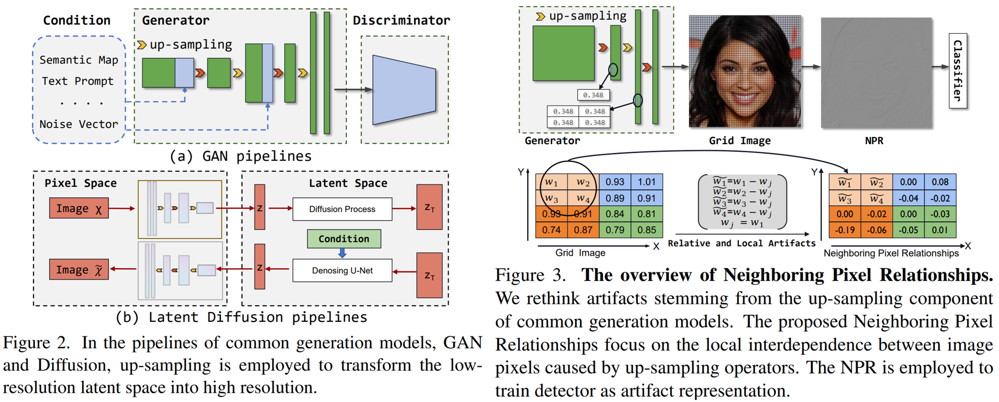

# Rethinking the Up-Sampling Operations in CNN-based Generative Network for Generalizable Deepfake Detection

<p align="center">
	<br>
	Beijing Jiaotong University, YanShan University, A*Star
</p>



Reference github repository for the paper [Rethinking the Up-Sampling Operations in CNN-based Generative Network for Generalizable Deepfake Detection](https://arxiv.org/abs/2312.10461).
```
@misc{tan2023rethinking,
      title={Rethinking the Up-Sampling Operations in CNN-based Generative Network for Generalizable Deepfake Detection}, 
      author={Chuangchuang Tan and Huan Liu and Yao Zhao and Shikui Wei and Guanghua Gu and Ping Liu and Yunchao Wei},
      year={2023},
      eprint={2312.10461},
      archivePrefix={arXiv},
      primaryClass={cs.CV}
}
```

## Environment setup
**Classification environment:** 
We recommend installing the required packages by running the command:
```sh
conda env create -f environment.yml
# or you can just reuse the c2p conda enviroment.
```

## Testing the detector
Check directly the run.sh, recall that we have two ckpts.
```sh
CUDA_VISIBLE_DEVICES=0 python test.py --model_path NPR_GenImage_sdv4.pth --batch_size {BS} --custom_dataset <path/to/dir>
```

The dataset structure would be the same to: FatFormer one:
```
|-- dalle/
|               |-- 0_real/
|               |-- 1_fake/
```

Expected results would be reporting AP and ACC:

```
=======================================
             CustomDataset
=======================================
Testing on dataset: DALLE
(0 CustomDataset) acc: 69.7; ap: 86.4
```